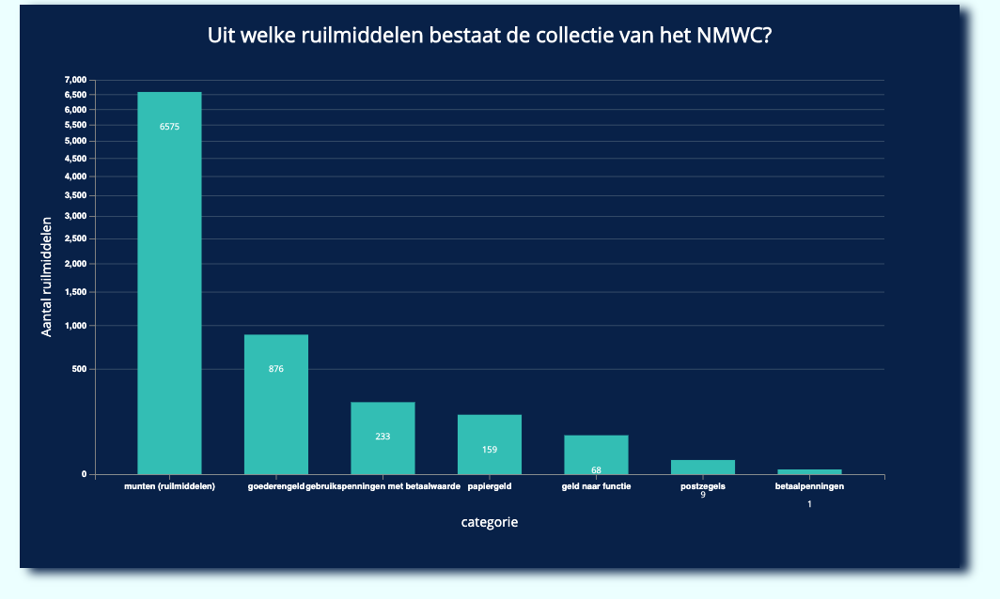
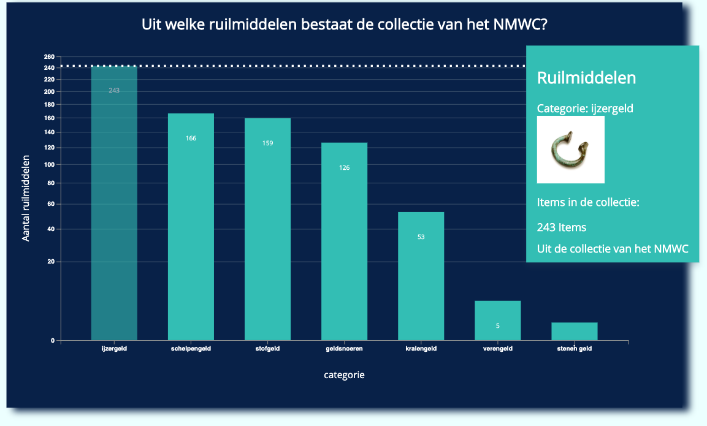
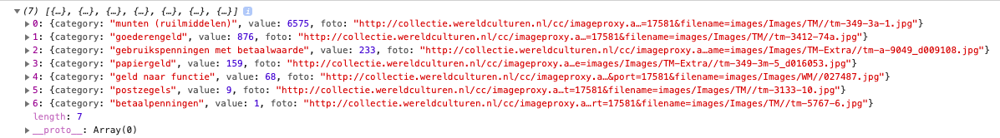

# Frontend-data
[Link naar live demo](https://emmaoudmaijer.github.io/frontend-data/public/)

Tijdens frontend-data heb ik een datavisualisatie gemaakt voor het Nationaal Museum van Wereldculturen die collectiebreed en nuttig is voor het museum. Deze visualisatie gaat over de ruilmiddelen 




### Het concept:
De datavisualisatie laat zien hoeveel ruilmiddelen er zijn binnen de collectie van het NMWC binnen de catagorie Munten. Onder munten zitten weer verschillende categorieën en met deze visualisatie kun je zien wat voor soort geld er is en hoeveel objecten er zijn binnen die verschillende categorieën. De interactie die is toegevoegd is een tooltip en een update aan de bar chart. Met de tooltip kan je als bezoeker van het museum een idee krijgen van wat er allemaal in ruilmiddelen zit. In de tooltip krijg je bij elke categorie nu een afbeelding te zien van een voorwerp uit de categorie. Zo krijg je een goed beeld van wat bijvoorbeeld 'stenengeld' is. 

De update die is toegevoegd zorgt ervoor dat je nog een beter beeld krijgt van de ruilmiddelen, doordat je in de categorie 'munten' weer verder kan klikken en je een nieuwe bar krijgt met de ruilmiddelen die alleen binnen de munten vallen. Zo krijg je een beter overzicht.

### Features
- Je kunt met de muis over een categorie gaan en dan zie je een duidelijke lijn van hoeveel objecten er onder die categorie vallen.
- Je kunt op de categorie munten door klikken om zo bij de subcategorieën van de munten te komen en weer een nieuwe bar chart krijgt met nieuwe inhoud.
- Je krijgt een toolbar te zien zodat je een beter beeld krijg van wat er allemaal in de categorie van elke bar zit.

Om meer te weten over mijn proces zie mijn [wiki](https://github.com/emmaoudmaijer/frontend-data/wiki/Concept-en-proces)

### Doelgroep
Deze visualisatie is voor de bezoekers van het nationaal museum van wereldculturen.

## Data & Query

De collectie van het NMWC bestaat uit meer dan 700000 objecten, dit is natuurlijk heel veel, maar ik wilde een kleiner deel van de collectie gaan pakken om daat iets interessants mee te laten zien. Daarom besloot ik om me te gaan focussen op ruilmiddelen. De data die ik heb gebruikt komt van het [NMWC](https://collectie.wereldculturen.nl/#/query/80b924c9-65af-47cd-ad25-d7be31beb0ef). De query die ik heb gebruikt om de data over de ruilmiddelen op te halen vind je hier onder. Ik heb de subcategorie 'geld' gepakt van de ruilmiddelen en daaronder goederengeld. Nu kun je dus in de visualisatie zien waar dat allemaal uit bestaat. Dit heb ik gedaan omdat je als bezoeker dan een beter beeld krijgt van wat voor soort ruilmiddelen er nou eigenlijk bestaan en in welke categorie deze horen.

```js
`
PREFIX rdf: <http://www.w3.org/1999/02/22-rdf-syntax-ns#>
PREFIX dc: <http://purl.org/dc/elements/1.1/>
PREFIX dct: <http://purl.org/dc/terms/>
PREFIX skos: <http://www.w3.org/2004/02/skos/core#>
PREFIX edm: <http://www.europeana.eu/schemas/edm/>
PREFIX foaf: <http://xmlns.com/foaf/0.1/>

SELECT ?cat ?catLabel (COUNT(?cho) AS ?choCount) (SAMPLE(?afb) AS ?afbSample)
WHERE {
<https://hdl.handle.net/20.500.11840/termmaster12591> skos:narrower/skos:narrower ?cat .

  ?cat skos:prefLabel ?catLabel .

  # geef de subcategorieen van ruilmiddelen
  ?cat skos:narrower* ?type .

  # geef objecten bij de onderliggende types
  ?cho edm:object ?type . 
  
    ?cho edm:isShownBy ?afb .
  
} GROUP BY ?cat ?catLabel
`
```

Ik haal hier de subcategorie op bij de ruilmiddelen die vallen onder geld. Zo heb ik 7 categorieën overgehouden met daarbinnen de ruilmiddelen. Deze query ga ik omzetten naar json in een functie zodat ik de waardes en categorieën kan gebruiken. Ik heb de query zo geschreven dat er geen lege waardes in de data voor komen en de console geeft dan ook precies terug wat ik zou willen, namelijk een foto, elke category van ruilmiddelen uit de eerste rang en de waarde van hoeveel ruilmiddelen er binnen die categorie in de collectie aanwezig zijn.


## Scale
De schaal in mijn visualisatie is een belangrijk punt. Dit was een punt waar ik zeker over na moest denken aangezien ik heel veel verschillende waardes in mijn data heb en. 1 waarde van 6000 en 1 waarde van 1 bijvoorbeeld. Dit ziet er gek uit als je de visualisatie zo laat zien. Dan valt de waarde met 1, helemaal weg. Om de visualisatie overzichtelijker te maken heb ik scaleLinear vervangen door scaleSqrt, waardoor je dus nu in de visualisatie veel duidelijker ziet hoeveel ruilmiddelen er nou per categorie in de collectie zitten. Dit kan soms een vertekend beeld geven van de data, vandaar omschrijf ik het even.

## Install project
Clone deze repository naar je computer:
```
git clone https://github.com/emmaoudmaijer/frontend-data.git
```
Ga naar de map in je terminal
```
cd frontend-data
```
Installeer packages
```
npm install
```
## Special thanks
Ik heb hulp gehad van Robert Spier bij de scale van mijn visualisatie

### Bronnen
Deze bronnen hebben mij geholpen bij het leren van d3 en het maken van de visualisatie
- http://bl.ocks.org/NPashaP/96447623ef4d342ee09b
- http://bl.ocks.org/jonahwilliams/2f16643b999ada7b1909
- https://wattenberger.com/blog/d3-interactive-charts
- https://jsfiddle.net/n57ee84g/1/
- https://www.youtube.com/watch?v=LO-8xiB3Z_Q
- https://www.d3indepth.com/enterexit/
- https://www.d3indepth.com/scales/
## Licence
ISC - Emma Oudmaijer